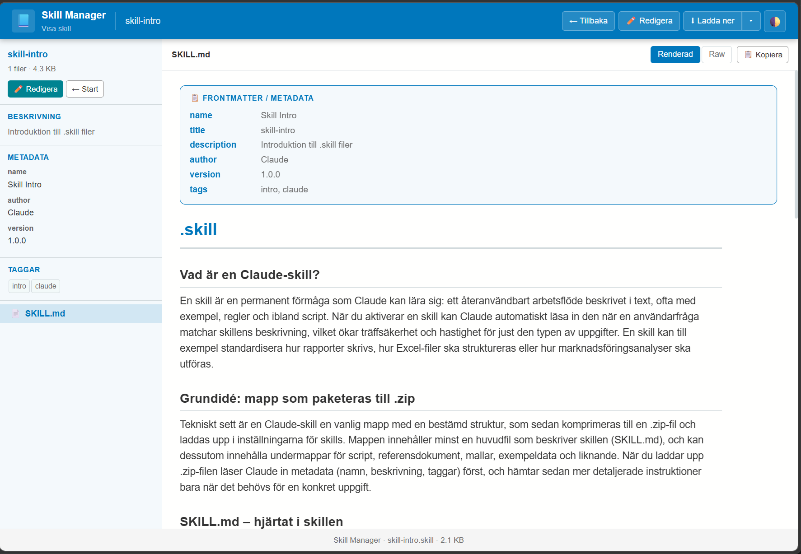

# Claude Skill Manager

[](https://php.net/)
[](https://opensource.org/licenses/MIT)
[](https://microsoft.github.io/monaco-editor/)

A professional PHP-based web application for creating, editing, and managing `.skill` files — ZIP archives containing Markdown instructions that describe reusable workflows for Claude AI.



## 🚀 Latest Updates

- 🧩 **MCP Server Added** — New `mcp/index.php` endpoint with JSON-RPC tools for AI clients
- 🧪 **MCP Test Panel** — New `mcp/test.php` for interactive endpoint testing
- 📘 **MCP Documentation** — New `MCP.md` with protocol and usage details
- 🌍 **Public Dashboard View** — Overview and view/download actions now available without login
- 🔐 **Role-Based Actions** — Edit/delete/upload/new skill actions stay protected behind login
- 📦 **Safer Upload Rules** — `.skill` and `.zip` uploads allowed, but archive content restricted to `.md` and `.txt`

## ✨ Features

- 🗂️ **Skill Library Management** — Upload, organize, and manage .skill files with searchable metadata
- ✏️ **Monaco Editor Integration** — Full VS Code editor experience with syntax highlighting
- 👁️ **Live Preview** — Real-time Markdown rendering with Mermaid diagram support  
- 🔐 **Secure Authentication** — Password-protected editing with session management
- 📱 **Responsive Design** — Works seamlessly across desktop and mobile devices
- 🏷️ **Tag System** — Organize skills with tags and advanced filtering
- 📥 **Import/Export** — Upload existing .skill files or download for backup
- 🌐 **Public Viewing** — Share skills publicly while keeping editing secure
- ⚡ **Performance Optimized** — Fast loading and efficient file handling

## 💡 Why Use Claude Skill Manager?

- **Professional Workflow**: Create and maintain reusable Claude AI skills with a proper development environment
- **Team Collaboration**: Share skills publicly while keeping editing secure with authentication
- **Version Control Ready**: Integrates well with Git workflows for backing up your skill library
- **No Dependencies**: Self-contained PHP application that runs anywhere PHP is supported
- **Production Ready**: Built with security best practices and professional code standards

## 📱 Project Structure

```
skill/
├── index.php           # Dashboard — searchable skill library with upload
├── login.php           # Authentication page  
├── logout.php          # Logout handler
├── download.php        # Serves downloads as .skill or .zip (filename extension option)
├── favicon.ico         # Custom favicon for the application
├── _common.php         # Shared functions, CSS and helpers
├── _auth.php           # Session authentication
├── MCP.md              # AI-focused MCP documentation
├── config/
│   ├── config.php      # Password and settings
│   └── .htaccess       # Blocks direct HTTP access to /config/
├── mcp/
│   ├── index.php       # MCP JSON-RPC endpoint
│   └── test.php        # MCP web test panel
├── view/
│   └── index.php       # Skill viewer — file tree, render markdown
├── edit/
│   └── index.php       # Create/edit skills — Monaco editor
├── content/            # Storage for .skill files (web server writable)
└── skill-intro.md      # Help text about .skill format (shown via ? button)
```

## 🖥️ Application Pages

### 🏠 Dashboard (`/`)
**Public overview (no login required).**
- Searchable and sortable table of all `.skill` files
- Filter by tags via dropdown or click on tag in list
- Columns: title, description, tags, author, file count, size, modified
- Upload (authenticated): accepts `.skill` and `.zip`
- Upload validation: archives may only contain `.md` and `.txt`
- `.zip` upload conversion: automatically creates `.skill` in `/content`
- Actions by auth state:
  - Guest: View, Download
  - Authenticated: View, Download, Edit, Delete
- Download button includes dropdown format choice (`.skill` or `.zip`)

### 👁️ Skill Viewer (`/view/?file=name.skill`)
**Public access — no authentication required.**
- File tree sidebar showing all files in the ZIP archive
- Renders Markdown via [marked.js](https://marked.js.org/) with [Mermaid](https://mermaid.js.org/) diagram support
- Sidebar shows frontmatter metadata, tags, and file info
- Toggle between rendered view and raw text
- Copy button for file contents
- Edit button shown only when authenticated (guests see Login button instead)
- Download button includes format dropdown (`.skill` / `.zip`)

### ✏️ Skill Editor (`/edit/?file=name.skill` or `/edit/` for new)
**Requires authentication.**
- [Monaco Editor](https://microsoft.github.io/monaco-editor/) (VS Code's editor) with syntax highlighting per file type
- File tree sidebar — click to switch files, each file has its own undo/redo
- Live preview with Mermaid diagram support
- Add new files to archive via `+ File` button
- Rename/move files inside archive
- Delete files inside archive
- Binary files (images etc.) preserved when saving
- Template button for `SKILL.md` inserts YAML frontmatter with metadata (including `author` and `tags`)
- Help button (`?`) shows `skill-intro.md` as modal

### 🤖 MCP Endpoint (`/mcp/index.php`)
**Public read endpoint for AI clients (JSON-RPC style).**
- Methods: `initialize`, `tools/list`, `tools/call`, `ping`
- Tools:
  - `list_skills`
  - `read_skill`
  - `search_skills`
- See [`MCP.md`](MCP.md) for payload examples and integration details

## 📦 .skill File Format

A `.skill` file is a **ZIP archive** with a defined folder structure:

```
my-skill/
├── SKILL.md            # Required — main file with frontmatter + instructions
├── scripts/            # Optional — executable code, e.g. Python or shell 
├── references/         # Optional — reference documents, style guides, specs
└── templates/          # Optional — output templates
```

### SKILL.md — Frontmatter Structure

```markdown
---
name: my-skill
title: My Skill  
description: Describe when and how this skill should be used
author: Your Name
version: 1.0
tags: php, web, api
location: /optional/path/reference
---

# My Skill

## Purpose
...

## Instructions
1. Step one
2. Step two
```

## 🚀 Quick Start

### Prerequisites
- **PHP 8.1+** with `ZipArchive` extension enabled
- **Web server** (Apache, Nginx, or PHP built-in server for development)
- **Write permissions** on the `/content/` directory for skill storage

### Installation Steps

1. **Clone the repository**
   ```bash
   git clone https://github.com/yllemo/claude-skill-manager.git
   cd claude-skill-manager
   ```

2. **Set up permissions**
   ```bash
   # Make content directory writable
   chmod 755 content/
   # Ensure config directory is protected (optional, .htaccess handles this)
   chmod 750 config/
   ```

3. **Configure your password**
   ```bash
   # Copy the configuration template
   cp config/config.php.example config/config.php
   ```
   Edit `config/config.php` and update the password:
   ```php
   'password' => 'your-secure-password',
   ```

4. **Launch the application**
   ```bash
   # Development server (recommended for local use)
   php -S localhost:8000
   
   # For production: Configure with Apache/Nginx
   ```

5. **Start managing skills!**
   - Browse to http://localhost:8000
   - Login with your configured password
   - Create your first skill by clicking "New Skill"

### ⚡ Quick Test
Upload a sample skill or create a new one to test all features are working correctly.

## 🔧 Configuration Options

Edit `config/config.php` to customize:
- `password`: Login password (supports bcrypt hashing)
- `session_lifetime`: How long login sessions last (default: 1 month)
- `app_name`: Application title shown in UI

## 🔒 Security Notes

- **Production deployment**: Use HTTPS and strong passwords
- **File permissions**: Ensure `/content/` is writable but not executable
- **Web server config**: Block direct access to `/config/` directory
- **Password hashing**: Use bcrypt for password storage in production:
  ```bash
  php -r "echo password_hash('your-password', PASSWORD_BCRYPT);"
  ```

## 📖 Usage

1. **Create a new skill:** Click "New Skill" or visit `/edit/`
2. **Edit existing skills:** Click "Edit" next to any skill in the dashboard
3. **View skills:** Skills can be viewed publicly at `/view/?file=skillname.skill`
4. **Upload skills:** Drag and drop `.skill` files onto the dashboard
5. **Organize with tags:** Use frontmatter tags for easy filtering and searching

## 🔧 Troubleshooting

**Common Issues:**
- **"Cannot write to content directory"**: Ensure `/content/` has write permissions (`chmod 755 content/`)
- **"ZipArchive not found"**: Install PHP zip extension (`php-zip` package)
- **Login not working**: Verify `config/config.php` exists and password is set correctly
- **Styles not loading**: Check that all files were uploaded and web server can serve static files

**Need Help?** Open an issue on GitHub with your PHP version and error details.

## 🤝 Contributing

We welcome contributions from the community! Whether you're fixing bugs, adding features, or improving documentation, your help makes this project better for everyone.

### How to Contribute

1. **Fork the project** on GitHub
2. **Create your feature branch** (`git checkout -b feature/amazing-feature`)
3. **Make your changes** and test thoroughly
4. **Commit your changes** (`git commit -m 'Add some amazing feature'`)
5. **Push to your branch** (`git push origin feature/amazing-feature`)
6. **Open a Pull Request** with a clear description

### Development Setup

```bash
# Clone your fork
git clone https://github.com/your-username/claude-skill-manager.git
cd claude-skill-manager

# Set up for development
cp config/config.php.example config/config.php
php -S localhost:8000

# Make your changes and test!
```

### What We Need Help With

- 🐛 Bug fixes and optimizations
- 🎨 UI/UX improvements  
- 📚 Documentation updates
- 🧪 Test coverage
- 🌐 Internationalization
- ♿ Accessibility improvements

Please read our [Contributing Guide](CONTRIBUTING.md) for detailed guidelines.

## 📄 License

This project is licensed under the MIT License - see the [LICENSE](LICENSE) file for details.

## 🙏 Acknowledgments

- [Monaco Editor](https://microsoft.github.io/monaco-editor/) for the excellent code editing experience
- [marked.js](https://marked.js.org/) for Markdown rendering
- [Mermaid](https://mermaid.js.org/) for diagram support
- The Claude AI team for making skills an amazing feature

## � Project Status

This is an **active project** currently in production use. We're continuously improving the codebase and adding new features based on user feedback.

**Current Status:** Stable ✅  
**Version:** 1.0+  
**Maintenance:** Active development  

## 🗺️ Roadmap

- [ ] **API Integration** — REST API for programmatic skill management
- [ ] **Bulk Operations** — Multi-select actions for managing multiple skills
- [ ] **Better Search** — Full-text search within skill contents
- [ ] **Themes** — Light/dark mode and custom themes
- [ ] **Backup/Restore** — Automated backup system
- [ ] **Collaboration** — Multi-user support with permissions

## 🔗 Related Links

- [Claude AI Skills Documentation](https://docs.anthropic.com/claude/docs/skills)
- [Skill File Format Specification](skill-intro.md)
- [Report Issues](https://github.com/yllemo/claude-skill-manager/issues)
- [View Changelog](CHANGELOG.md)

---

**Made with ❤️ for the Claude AI community**

**Need help?** Open an issue or check the [skill-intro.md](skill-intro.md) for detailed information about the .skill file format.
- Skrivbehörighet på `/content/`-mappen

### Snabbstart

```bash
git clone <repo> skill
cd skill
chmod 755 content/
php -S localhost:8080
```

Öppna `http://localhost:8080` i webbläsaren och logga in.

### Apache / Nginx
Peka webbroten mot mappen. Inga `.htaccess`-regler krävs utöver den i `/config/`.

---

## Konfiguration

Redigera `/config/config.php`:

```php
return [
    'password'         => 'admin123',   // Byt till eget lösenord
    'session_lifetime' => 2592000,      // Sekunder — standard 1 månad
    'app_name'         => 'Skill Manager',
];
```

### Bcrypt-lösenord (rekommenderat)

```bash
php -r "echo password_hash('ditt-lösenord', PASSWORD_BCRYPT);"
```

Klistra in den genererade hashen som `password`-värde — systemet känner igen `$2y$...` automatiskt.

---

## Åtkomstkontroll

| Sida | Inloggning krävs |
|------|-----------------|
| `/` (lista) | ✅ Ja |
| `/edit/` | ✅ Ja |
| `/view/` | ❌ Nej — öppen |
| `/login.php` | ❌ Nej |
| `/download.php` | ❌ Nej |

Sessionen varar i konfigurerad tid (standard: 1 månad) och överlever webbläsarstängning.

---

## Beroenden (CDN)

Alla externa bibliotek laddas från CDN — ingen byggprocess krävs.

| Bibliotek | Version | Användning |
|-----------|---------|------------|
| [marked.js](https://marked.js.org/) | latest | Markdown-rendering |
| [Mermaid](https://mermaid.js.org/) | latest | Diagram i Markdown |
| [Monaco Editor](https://microsoft.github.io/monaco-editor/) | 0.47.0 | Kodredigerare i /edit/ |

---

## Tema

Ljust och mörkt tema — sparas i `localStorage`. Klicka på 🌓 i headern för att växla. Monaco och Mermaid synkar automatiskt med valt tema.
