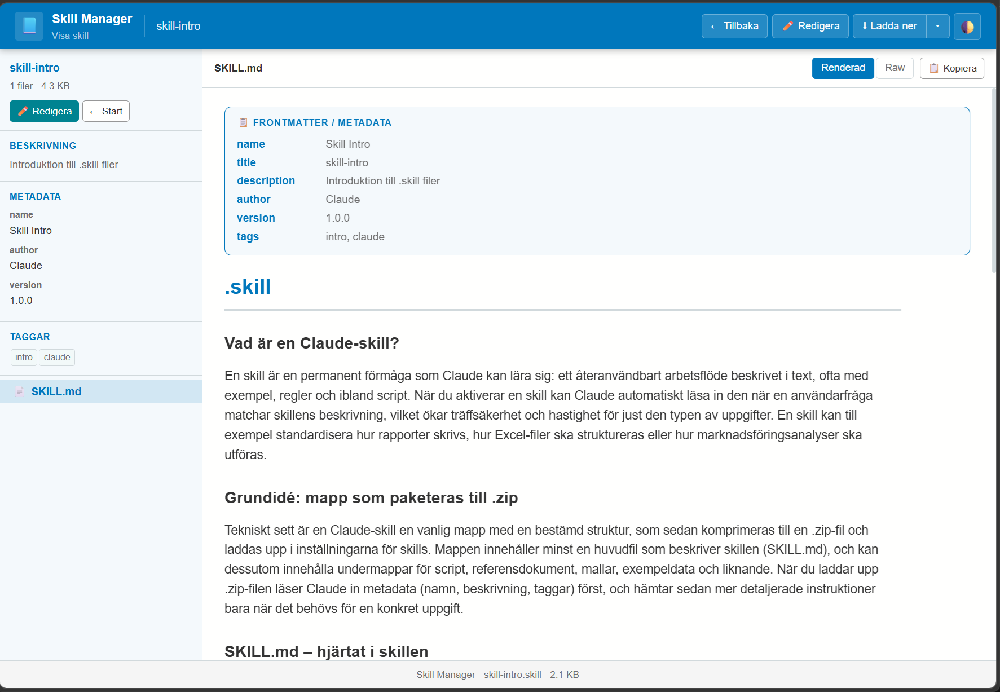

# Claude Skill Manager

[](https://php.net/)
[](https://opensource.org/licenses/MIT)
[](https://microsoft.github.io/monaco-editor/)

A professional PHP-based web application for creating, editing, and managing `.skill` files — ZIP archives containing Markdown instructions that describe reusable workflows for Claude AI.



## 🚀 Latest Updates

- 🔄 **Git sync (admin)** — Push all `/content/*.skill` to GitHub or GitLab from Settings → Git sync ([php-git-simple](https://github.com/yllemo/php-git-simple) API client)
- 📎 **Links & ideas (admin)** — Collect external repos, skill collections, pages, and planned-skill ideas under Settings → Links & ideas
- 🖼️ **Skill Canvas** — Open a skill on an external whiteboard from the viewer; URL template in `config/settings.php` (`skill_canvas_url`)
- 💬 **SKILL Chat** — `chat.html` loads a skill via `?file=` and chats against its contents; button in the viewer (new tab)
- 🔗 **Public skill URLs** — Short shareable links at `/s/name.skill` for external tools (Skill Canvas, Chat); `/content/` blocked from direct HTTP access
- 👥 **Multi-user ACL** — User accounts in `config/users.php` (bcrypt passwords); roles `admin` and `user`
- ⚙️ **Settings page** — Guest access, visibility, users, links & ideas, and Git sync (admin only)
- 📁 **Configurable file types** — Allowed extensions and MIME types in `config/files.php` (`.sef`, `.ac`, `.csv`, code, images, and more)
- 🔗 **Direct file URLs** — Open any archive file via `/view/?file=name.skill&path=docs/test.html` (shareable links)
- ✏️ **Multi-format editing** — Monaco syntax highlighting for many text types; markdown preview only for `.md`
- 👁️ **Smarter viewer** — `.md` rendered in the UI; other types open in a new tab with correct `Content-Type`
- 🌐 **UI language (i18n)** — Swedish and English interface via `config/lang.php` (default: Swedish)
- 🔍 **Enhanced Mermaid Diagrams** — Interactive fullscreen viewing with pan/zoom, text selection, and diagram source code access
- 📄 **Improved YAML Support** — Enhanced frontmatter parsing with multi-line description support using YAML block scalars
- 🖨️ **Print-Friendly Styles** — Optimized printing layouts with clean, professional output
- 🤖 **AI-Powered Editing** — Complete AI integration with OpenAI, Ollama, and LM Studio support
- 💬 **Interactive AI Chat** — Real-time AI assistance for skill creation and editing with configurable system prompts
- ⚡ **Dual Editing Modes** — Seamlessly switch between Monaco editor and AI-assisted editing modes
- 🏗️ **Smart Templates** — Enhanced file structure templates with predefined skill directory organization
- 🔧 **Enhanced Configuration** — Comprehensive AI provider settings with secure API key management
- 📱 **Mobile Responsive** — Improved mobile navigation with hamburger menu and responsive design
- 🔐 **Security Enhanced** — Secure API key storage via `key.env` with comprehensive gitignore protection
- 📥 **Bulk Operations** — New bulk content download functionality for complete archive management

## ✨ Features

- 🤖 **AI-Powered Editing** — Chat with AI assistants to create and refine skills using OpenAI, Ollama, or LM Studio
- 🗂️ **Skill Library Management** — Upload, organize, and manage .skill files with searchable metadata
- ✏️ **Dual Editor Experience** — Choose between Monaco Editor (VS Code-style) or AI-assisted editing
- 👁️ **Live Preview** — Real-time Markdown rendering for `.md` with enhanced Mermaid diagram support and fullscreen viewing
- 📂 **Many file types** — HTML, JSON, JS, CSS, Python, SVG, `.sef` (Smart Exam Format), `.ac` (ArchiCode), CSV, BPMN, images, and more (configurable)
- 🔐 **Access control** — Optional guest access; per-skill `visibility` in SKILL.md; multi-user login with hashed passwords
- 🖱️ **Interactive Diagrams** — Pan, zoom, and select text in Mermaid diagrams with dedicated fullscreen mode
- 📱 **Responsive Design** — Works seamlessly across desktop and mobile devices with print-friendly styles
- 🏷️ **Tag System** — Organize skills with tags and advanced filtering
- 📥 **Import/Export** — Upload existing .skill files or download for backup
- 🌐 **Public Viewing** — Share skills publicly while keeping editing secure
- ⚡ **Performance Optimized** — Fast loading and efficient file handling
- 🧩 **MCP Integration** — JSON-RPC endpoint for AI client integration
- 🖼️ **Skill Canvas & Chat** — External whiteboard link and local `chat.html` from the viewer, both using the same public `/s/…` skill URL
- 🔄 **Git sync** — Admin push of `content/*.skill` to GitHub or GitLab ([php-git-simple](https://github.com/yllemo/php-git-simple))
- 📎 **Links & ideas** — Admin backlog of external resources and planned skills (`config/links.php`)
- 🌐 **Localization** — Built-in Swedish (`sv`) and English (`en`); switch UI language in `config/lang.php`

## 💡 Why Use Claude Skill Manager?

- **Professional Workflow**: Create and maintain reusable Claude AI skills with a proper development environment
- **Team Collaboration**: Share skills publicly while keeping editing secure with authentication
- **Version Control Ready**: Integrates well with Git workflows for backing up your skill library
- **No Dependencies**: Self-contained PHP application that runs anywhere PHP is supported
- **Production Ready**: Built with security best practices and professional code standards

## 📱 Project Structure

```
skill/
├── index.php           # Dashboard — searchable skill library with upload
├── login.php           # Login (username + password)
├── logout.php          # Logout handler
├── download.php        # Download .skill/.zip; inline mode via ?inline=1
├── download_content.php # Bulk content download (requires authentication)
├── chat.html           # Standalone chat UI — load skill from ?file= URL
├── favicon.ico         # Custom favicon for the application
├── _common.php         # Shared functions, CSS and helpers
├── _lang.php           # UI translations (built-in sv/en) and __( ) helper
├── _auth.php           # Session authentication
├── _git.php            # Git sync helpers (content/ → GitHub/GitLab)
├── _links.php          # Admin links & skill-idea list helpers
├── lib/
│   └── GitRepoClient.php # REST client for GitHub + GitLab
├── AI.md               # AI functionality documentation
├── MCP.md              # AI-focused MCP documentation
├── config/
│   ├── config.php        # App name, session lifetime; legacy password for first-time user migration
│   ├── users.php         # User accounts (bcrypt hashes) — auto-created on first login
│   ├── users.php.example # Template for users.php
│   ├── settings.php      # Guest access and skill visibility rules
│   ├── settings.php.example
│   ├── git.php           # Git sync credentials (gitignore) — copy from git.php.example
│   ├── git.php.example
│   ├── links.php         # Admin links & skill ideas — copy from links.php.example
│   ├── links.php.example
│   ├── files.php         # Allowed file extensions and MIME types for archives
│   ├── files.php.example
│   ├── lang.php          # UI locale (sv/en/…) and optional string overrides
│   ├── ai.php            # AI configuration (providers, models, system prompts)
│   ├── key.env.example   # Template for API keys and environment variables
│   └── .htaccess         # Blocks direct HTTP access to /config/
├── settings/
│   └── index.php         # Access, users, links & ideas, Git sync (admin only)
├── ai/
│   ├── index.php       # AI-powered skill editor
│   ├── chat.php        # AI chat API endpoint
│   └── ai_lib.php      # AI integration library
├── mcp/
│   ├── index.php       # MCP JSON-RPC endpoint
│   └── test.php        # MCP web test panel
├── s/
│   ├── index.php       # Public inline .skill URL (/s/name.skill)
│   └── .htaccess       # Rewrite + disable gzip for zip serving
├── view/
│   └── index.php       # Skill viewer — file tree, render markdown
├── edit/
│   └── index.php       # Create/edit skills — Monaco editor
├── content/            # Storage for .skill files (writable; direct HTTP blocked)
│   └── .htaccess       # Deny direct access — use /s/ or download.php
└── skill-intro.md      # Help text about .skill format (shown via ? button)
```

## 🖥️ Application Pages

### 🏠 Dashboard (`/`)
**Overview — guest access depends on settings (see `/settings/`).**
- Searchable and sortable table of `.skill` files (filtered by login state and visibility)
- Filter by tags via dropdown or click on tag in list
- Columns: title, description, tags, author, file count, size, modified; **visibility** (`PUBLIC` / `INTERNAL`) when logged in
- Upload (authenticated): accepts `.skill` and `.zip`
- Upload validation: archive entries must use extensions listed in `config/files.php` (`allowed_extensions`)
- `.zip` upload conversion: automatically creates `.skill` in `/content` (only allowed files are copied)
- Actions by auth state:
  - Guest: View/Download public skills (if guest access enabled)
  - Authenticated: View, Download, Edit, Delete (all skills including `INTERNAL`)
- Download button includes dropdown format choice (`.skill` or `.zip`)
- **Settings** button (admin only) in the header

### 👁️ Skill Viewer (`/view/?file=name.skill`)
**Access depends on global settings and per-skill `visibility` in SKILL.md.**
- File tree sidebar showing all files in the ZIP archive
- **`.md` files** — Rendered in the main panel via [marked.js](https://marked.js.org/) with enhanced [Mermaid](https://mermaid.js.org/) diagram support
- **Other files** (HTML, JSON, images, `.sef`, `.ac`, etc.) — Open in a new browser tab via a shareable query-string URL
- **Direct links** to any file in the archive:
  ```
  /view/?file=my-skill.skill&path=docs/test.html
  /view/?file=my-skill.skill&path=assets/diagram.svg
  /view/?file=my-skill.skill&path=SKILL.md          # opens in viewer (rendered)
  /view/?file=my-skill.skill&path=SKILL.md&raw=1    # raw file content
  ```
- **Interactive Mermaid diagrams** — Fullscreen viewing with pan/zoom, text selection in SVG elements
- Sidebar shows frontmatter metadata, tags, and file info with support for multi-line descriptions
- Toggle between rendered view and raw text (for `.md` in the main panel)
- Copy button for file contents
- Edit button shown only when authenticated (guests see Login button instead)
- **Skill Canvas** button (new tab) when `skill_canvas_url` is set in `config/settings.php`
- **Chat** button (new tab) opens `chat.html?file=…` with the same public skill URL
- **Settings** button (admin only, header / mobile menu)
- Download button includes format dropdown (`.skill` / `.zip`)
- **Print-friendly** — Optimized printing with clean layout (hides navigation, headers, etc.)

### ✏️ Skill Editor (`/edit/?file=name.skill` or `/edit/` for new)
**Requires authentication.**
- [Monaco Editor](https://microsoft.github.io/monaco-editor/) (VS Code's editor) with syntax highlighting per file type (JSON, HTML, CSS, Python, SQL, `.sef`, `.ac`, and more)
- File tree sidebar — click to switch files, each file has its own undo/redo
- **Live markdown preview** (split pane) for `.md` only — other text types use the editor full-width without preview rendering
- Add new files to archive via `+ File` button with smart structure templates
- Rename/move files inside archive
- Delete files inside archive
- Binary files (images etc.) preserved when saving
- Template button for `SKILL.md` inserts YAML frontmatter with metadata (including `author` and `tags`)
- Switch to AI editing mode button
- Help button (`?`) shows `skill-intro.md` as modal

### 🤖 AI Editor (`/ai/?file=name.skill` or `/ai/` for new)
**Requires authentication.**
- AI-powered skill creation and editing with chat interface
- Support for multiple AI providers: OpenAI, Ollama, and LM Studio
- Configurable system prompts for different editing styles
- File content inclusion in AI prompts for context-aware editing
- Direct file replacement or selective content insertion from AI responses
- Smart markdown extraction from AI responses
- Local AI support (browser-to-localhost) for privacy-focused workflows  
- Seamless switching between AI and Monaco editor modes
- All traditional editing features (file management, templates, etc.)
- AI provider settings with model selection and temperature control

### 💬 SKILL Chat (`/chat.html`)
**Standalone chat against skill content (opens from viewer or directly).**
- Load a `.skill` archive from `?file=` — absolute URL to `/s/name.skill` (same format as Skill Canvas)
- Example: `chat.html?file=https%3A%2F%2Fskill.example.se%2Fs%2Fmy-skill.skill`
- Select which text files to include as context; chat via Ollama, LM Studio, or OpenAI (browser or server)
- Built-in skill templates and export chat as Markdown

### ⚙️ Settings (`/settings/`)
**Requires admin login.** Tabs:

- **Access & users** — Guest access; `visibility` from SKILL.md; default visibility; user CRUD (`config/users.php`)
- **Links & ideas** — External repos, collections, pages, and planned skill ideas (`config/links.php`); filter by type/status
- **Git sync** — Configure GitHub/GitLab token + repo; test connection; push all `content/*.skill` to the remote path (see [php-git-simple](https://github.com/yllemo/php-git-simple)). Settings in `config/git.php` (gitignored).

### 🤖 MCP Endpoint (`/mcp/index.php`)
**Read endpoint for AI clients (JSON-RPC style). Respects access and visibility settings.**
- Methods: `initialize`, `tools/list`, `tools/call`, `ping`
- Tools:
  - `list_skills`
  - `read_skill`
  - `search_skills`
- See [`MCP.md`](MCP.md) for payload examples and integration details

## 📦 .skill File Format

A `.skill` file is a **ZIP archive** with a defined folder structure:

```
my-skill/
├── SKILL.md            # Required — main file with frontmatter + instructions
├── scripts/            # Optional — executable code, e.g. Python or shell 
├── references/         # Optional — reference documents, style guides, specs
├── templates/          # Optional — output templates
└── docs/               # Optional — HTML, JSON, .sef, .ac, CSV, or other allowed types
```

**Allowed entry types** are defined in `config/files.php`. By default this includes Markdown, plain text, CSV/TSV, JSON/JSONL, HTML, SVG, BPMN, common source files (JS, TS, CSS, Python, PHP, SQL, …), **`.sef` (Smart Exam Format)**, **`.ac` (ArchiCode)**, config files (`.env`, `.ini`, …), and raster images. Adjust the lists to match your workflow.

### SKILL.md — Frontmatter Structure

```markdown
---
name: my-skill
title: My Skill  
description: >
  Multi-line descriptions are supported using YAML block scalars.
  This allows for detailed explanations that span multiple lines
  while maintaining proper formatting.
author: Your Name
version: 1.0
tags: php, web, api
visibility: public
location: /optional/path/reference
---

# My Skill

## Purpose
...

## Instructions
1. Step one
2. Step two
```

**Enhanced YAML Support**: The frontmatter parser supports YAML block scalars (`>` and `|`) for multi-line descriptions.

**Visibility** (`public` or `internal`): Controls who can see the skill when guest access is enabled and per-skill visibility is active in settings. Logged-in users always see all skills. New skills get the default visibility from `/settings/`.

## 🚀 Quick Start

### Prerequisites
- **PHP 8.1+** with `ZipArchive` extension enabled
- **Web server** (Apache, Nginx, or PHP built-in server for development)
- **Write permissions** on `/content/` for skill storage and on `/config/` if saving settings/users via the web UI

### Installation Steps

1. **Clone the repository**
   ```bash
   git clone https://github.com/yllemo/claude-skill-manager.git
   cd claude-skill-manager
   ```

2. **Set up permissions**
   ```bash
   # Make content directory writable
   chmod 755 content/
   # Ensure config directory is protected (optional, .htaccess handles this)
   chmod 750 config/
   ```

3. **Configure the application**
   ```bash
   cp config/config.php.example config/config.php
   cp config/files.php.example config/files.php    # if not already present
   cp config/settings.php.example config/settings.php
   ```
   Edit `config/config.php`:
   ```php
   'password' => 'your-secure-password',  // used once to create config/users.php (admin account)
   'session_lifetime' => 2592000,
   ```

   On **first login** (`admin` + password above), the app creates `config/users.php` with a bcrypt hash. Change the password under **Settings → Users** afterward.

   Edit `config/files.php` for allowed upload types (see [Configuration Options](#-configuration-options)).

   **Optional: Configure AI providers**
   ```bash
   # Copy AI environment template for API keys
   cp config/key.env.example config/key.env
   ```
   Edit `config/key.env` for AI features (OpenAI API key, custom AI endpoints):
   ```env
   OPENAI_API_KEY=your-api-key-here
   # OLLAMA_BASE=http://127.0.0.1:11434/v1  # Local Ollama (default)
   # LMSTUDIO_BASE=http://127.0.0.1:1234/v1  # Local LM Studio (default)
   ```

4. **Launch the application**
   ```bash
   # Development server (recommended for local use)
   php -S localhost:8000
   
   # For production: Configure with Apache/Nginx
   ```

5. **Start managing skills!**
   - Browse to http://localhost:8000
   - Log in as **admin** with your configured password
   - Open **Settings** (⚙️) to manage access, users, and defaults
   - Create your first skill via **New Skill**

### ⚡ Quick Test
Upload a sample skill or create a new one to test all features are working correctly.

## 🔧 Configuration Options

Edit `config/config.php` to customize:
- `password`: Legacy bootstrap password — used only when `config/users.php` is created on first login
- `session_lifetime`: How long login sessions last (default: 1 month)
- `app_name`: Application title in the UI

Edit `config/settings.php` for **access control**:

| Key | Purpose |
|-----|---------|
| `allow_guest_access` | If `false`, all viewing/downloading requires login |
| `use_skill_visibility` | If `true`, guests only see skills with `visibility: public` in SKILL.md |
| `default_skill_visibility` | `public` or `internal` — used in new-skill template and when frontmatter omits `visibility` |
| `skill_canvas_url` | Skill Canvas link template; `{skill_url}` = URL-encoded public `/s/…` URL. Empty = hide Canvas button |
| `skill_file_base_url` | Public base URL (e.g. `https://skill.example.se`) for `/s/` and Canvas links. Empty = auto-detect from request |

**Public skill file URLs** (for Skill Canvas, Chat, and other tools):

| URL | Purpose |
|-----|---------|
| `/s/my-skill.skill` | Short inline URL — serves the zip without exposing `/content/` |
| `/download.php?file=my-skill.skill` | Download as attachment (`.skill` or `&ext=zip`) |
| `/download.php?file=my-skill.skill&inline=1` | Same inline serve as `/s/` |

External tools need **guest access** and **`visibility: public`** on the skill (or they receive `401`/`403` instead of zip data).

**Nginx** (if not using Apache): route `/s/*.skill` to `/s/index.php` (see `s/.htaccess` for Apache equivalent).

Edit `config/users.php` for **user accounts** (normally managed via `/settings/`):

| Field | Purpose |
|-------|---------|
| `users[username].password` | Bcrypt hash only (never plaintext) |
| `users[username].role` | `admin` (settings + users) or `user` (edit/view skills) |

Edit `config/files.php` to customize **allowed file types** in `.skill` archives:

| Key | Purpose |
|-----|---------|
| `allowed_extensions` | Extensions permitted on upload (`.skill` / `.zip`) |
| `text_extensions` | Treated as UTF-8 text — editable in Monaco and readable via `/view/?path=…` |
| `image_extensions` | Embedded as images in the viewer (up to 512 KB per file when loading the tree) |
| `mime_types` | `Content-Type` when serving a file via `&path=` (and for image data URLs) |

Default highlights include `.md`, `.txt`, `.csv`, `.json`, `.sef`, `.ac`, `.html`, `.svg`, `.bpmn`, and common code/config extensions. Example MIME overrides:

```php
'sef' => 'application/json',           // Smart Exam Format
'ac'  => 'application/vnd.archicode',  // ArchiCode
```

Copy `config/files.php.example` as a starting point for a minimal allowlist.

Edit `config/lang.php` to customize the **UI language** (labels, buttons, errors, etc.):
- **`locale`**: Active interface language. Built-in values: `sv` (Swedish, default), `en` (English). If `config/lang.php` is missing, the app behaves as **`sv`** using strings from `_lang.php`.
- **`strings`**: Optional per-language overrides. Keys match the identifiers in `_lang.php` (for example `index.hdr_overview`, `common.login`). Example:
  ```php
  return [
      'locale' => 'en',
      'strings' => [
          'en' => [
              'index.hdr_overview' => 'Overview',
          ],
      ],
  ];
  ```
- **More languages**: Add another code under `strings` (for example `'de' => [...]`) and set `'locale' => 'de'`. Any key you omit falls back to the Swedish built-ins.

Edit `config/ai.php` to configure AI features:
- `default_provider`: Choose between `openai`, `ollama`, or `lmstudio`
- `models`: Default model names for each provider
- `system_prompt`: Default system prompt for AI editing (overrideable in UI)
- `openai_base`, `ollama_base`, `lmstudio_base`: API endpoints for each provider
- `curl_timeout_seconds`: Timeout for AI requests

Edit `config/key.env` for sensitive configuration:
- `OPENAI_API_KEY`: Your OpenAI API key (required for OpenAI provider)
- `OLLAMA_BASE`: Custom Ollama endpoint (optional, overrides config/ai.php)
- `LMSTUDIO_BASE`: Custom LM Studio endpoint (optional, overrides config/ai.php)
- `app_name`: Application title shown in UI

## 🔒 Security Notes

- **Production deployment**: Use HTTPS and strong passwords (minimum 6 characters)
- **File permissions**: Ensure `/content/` is writable; `/config/` must be writable only if using the settings UI to save users/settings
- **Web server config**: Block direct HTTP access to `/config/` (`.htaccess` included for Apache) and `/content/` (`.htaccess` denies direct file access)
- **Passwords**: Stored as bcrypt hashes in `config/users.php` — not in `config.php`
- **Roles**: Only `admin` users can open `/settings/` and manage accounts

## 📖 Usage

1. **Create a new skill:** Click "New Skill" or visit `/edit/`
2. **Log in:** Use username + password at `/login.php` (default user: `admin`)
3. **Settings (admin):** Open `/settings/` to configure guest access, visibility, and users
4. **Edit existing skills:** Click "Edit" next to any skill in the dashboard
5. **View skills:** `/view/?file=skillname.skill` (subject to access settings)
6. **Link to a file inside a skill:** `/view/?file=skillname.skill&path=references/guide.html`
7. **Skill Canvas / Chat:** Use the buttons in the viewer, or share `https://your-host/s/skillname.skill` with external tools
8. **Upload skills:** Drag and drop `.skill` or `.zip` onto the dashboard (entries must match `allowed_extensions`)
9. **Organize with tags:** Use frontmatter tags for easy filtering and searching

## 🔧 Troubleshooting

**Common Issues:**
- **"Cannot write to content directory"**: Ensure `/content/` has write permissions (`chmod 755 content/`)
- **"ZipArchive not found"**: Install PHP zip extension (`php-zip` package)
- **Login not working**: Verify `config/config.php` exists; on first run log in as `admin`. Check that `config/users.php` was created and is readable
- **Cannot save settings**: Ensure PHP can write to `config/` (`settings.php`, `users.php`)
- **Styles not loading**: Check that all files were uploaded and web server can serve static files
- **Upload rejected for a file type**: Add the extension to `allowed_extensions` in `config/files.php`
- **"File not found in archive"** on a direct link: Use the path as stored in the ZIP (e.g. `docs/test.html`, not `/docs/test.html`)
- **Skill Canvas / Chat: "not a zip file"** — Response is probably HTML or an error page. Verify with `curl -s https://your-host/s/name.skill | xxd | head -1` (should start with `504b` = `PK`). Ensure the skill is public and guest access is enabled
- **`/s/name.skill` returns 404** — On Nginx, add a rewrite to `s/index.php`; Apache uses `s/.htaccess`

**Need Help?** Open an issue on GitHub with your PHP version and error details.

## 🤝 Contributing

We welcome contributions from the community! Whether you're fixing bugs, adding features, or improving documentation, your help makes this project better for everyone.

### How to Contribute

1. **Fork the project** on GitHub
2. **Create your feature branch** (`git checkout -b feature/amazing-feature`)
3. **Make your changes** and test thoroughly
4. **Commit your changes** (`git commit -m 'Add some amazing feature'`)
5. **Push to your branch** (`git push origin feature/amazing-feature`)
6. **Open a Pull Request** with a clear description

### Development Setup

```bash
# Clone your fork
git clone https://github.com/your-username/claude-skill-manager.git
cd claude-skill-manager

# Set up for development
cp config/config.php.example config/config.php
cp config/settings.php.example config/settings.php
php -S localhost:8000

# Make your changes and test!
```

### What We Need Help With

- 🐛 Bug fixes and optimizations
- 🎨 UI/UX improvements  
- 📚 Documentation updates
- 🧪 Test coverage
- 🌐 Additional locales and translation polish (strings live in `_lang.php` + `config/lang.php`)
- ♿ Accessibility improvements

Please read our [Contributing Guide](CONTRIBUTING.md) for detailed guidelines.

## 📄 License

This project is licensed under the MIT License - see the [LICENSE](LICENSE) file for details.

## 🙏 Acknowledgments

- [Monaco Editor](https://microsoft.github.io/monaco-editor/) for the excellent code editing experience
- [marked.js](https://marked.js.org/) for Markdown rendering
- [Mermaid](https://mermaid.js.org/) for diagram support
- The Claude AI team for making skills an amazing feature

## 📊 Project Status

This is an **active project** currently in production use. We're continuously improving the codebase and adding new features based on user feedback.

**Current Status:** Stable ✅  
**Version:** 1.3.2  
**Maintenance:** Active development  

## 🗺️ Roadmap

- [ ] **API Integration** — REST API for programmatic skill management
- [ ] **Bulk Operations** — Multi-select actions for managing multiple skills
- [ ] **Better Search** — Full-text search within skill contents
- [x] **Themes** — Light/dark mode
- [ ] **Backup/Restore** — Automated backup system
- [x] **Collaboration** — Multi-user accounts with admin/user roles

## 🔗 Related Links

- [Claude AI Skills Documentation](https://docs.anthropic.com/claude/docs/skills)
- [Skill File Format Specification](skill-intro.md)
- [Report Issues](https://github.com/yllemo/claude-skill-manager/issues)
- [View Changelog](CHANGELOG.md)

---

**Made with ❤️ for the Claude AI community**

**Need help?** Open an issue or check the [skill-intro.md](skill-intro.md) for detailed information about the .skill file format.
